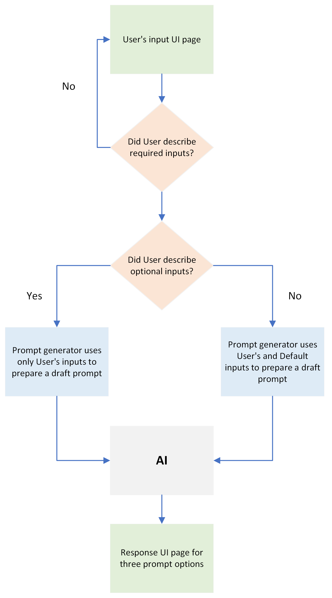

# Prompt Engineering

This project consists of a backend (`prompt-generator`) and a frontend (`ui-form`) designed to interact with the OpenAI API to generate a high-quality prompts based on user input.

## Flow

## Getting Started

The README files of `prompt-generator` and `ui-form` provide step-by-step instructions on how to set up and run both the backend (`prompt-generator`) and the frontend (`ui-form`) components of your project. It also includes usage information and guidelines for contributing. If there are any additional details or configurations specific to your project, be sure to update the relevant sections accordingly.
